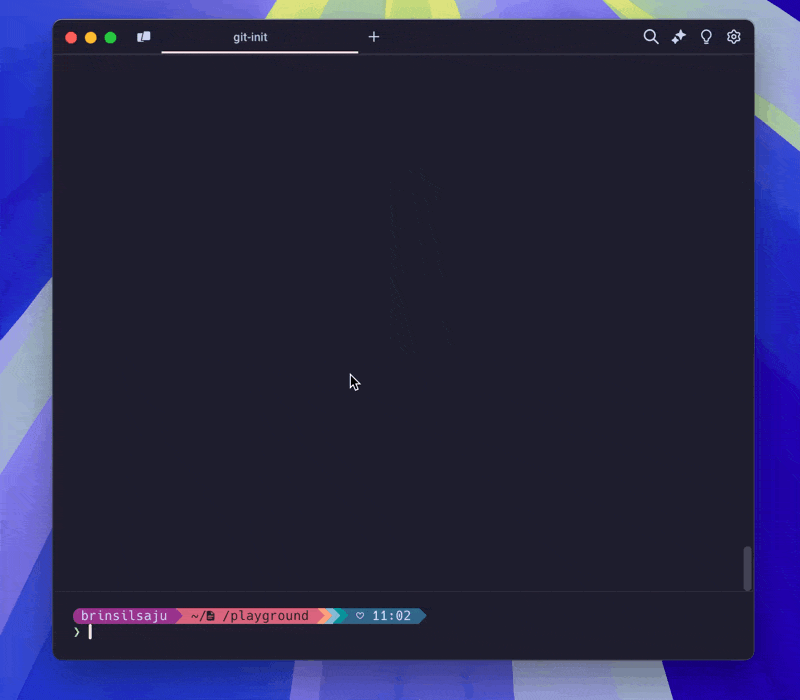

<div align="center">
    <a href="https://github.com/BrinsilElias/git-init">
        
    </a>
    <h2 align="center">git-init</h2>
    <p align="center">
        A tiny and simple cli tool to initialize a git repository and more ... 🪴
        <br />
        <a href="https://github.com/BrinsilElias/git-init/issues">Report Bug</a>
        |
        <a href="https://github.com/BrinsilElias/git-init/issues">Request Feature</a>
    </p>
</div>

## 🚀 Features


- Initialize git repo 🚀
- Include License and gitignore templates ⚙️
- Add remote repository url 🌐

## 📦 Usage

You will need to have [Node.js](https://nodejs.org/en/) installed on your machine.

```bash
npx git-init
```

Alternatively, you can install it globally:

```bash
npm i -g git-init
```

And then run:

```bash
git-init
```

## 🎊 Special Thanks

* [Oleksii](https://www.github.com/alexeyraspopov) for ([picocolors](https://www.github.com/alexeyraspopov/picocolors)).
* [bombshell-dev](https://github.com/bombshell-dev) for ([clack](https://github.com/bombshell-dev/clack)).
* [Egoist](https://www.github.com/egoist) for ([tsup](https://www.github.com/egoist/tsup))

I hope you find this tool useful! 🌟

Made with ❤️ by [Brinsil](https://www.github.com/BrinsilElias).
